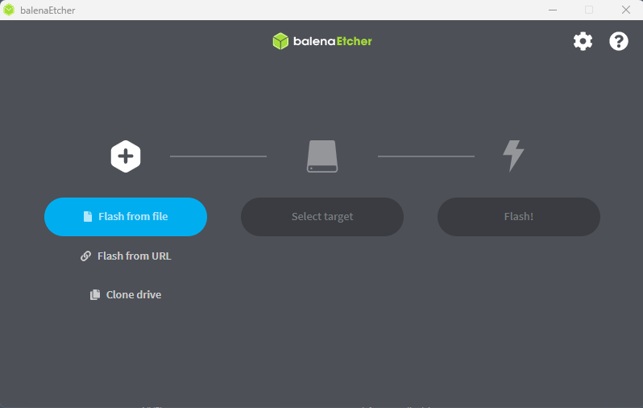
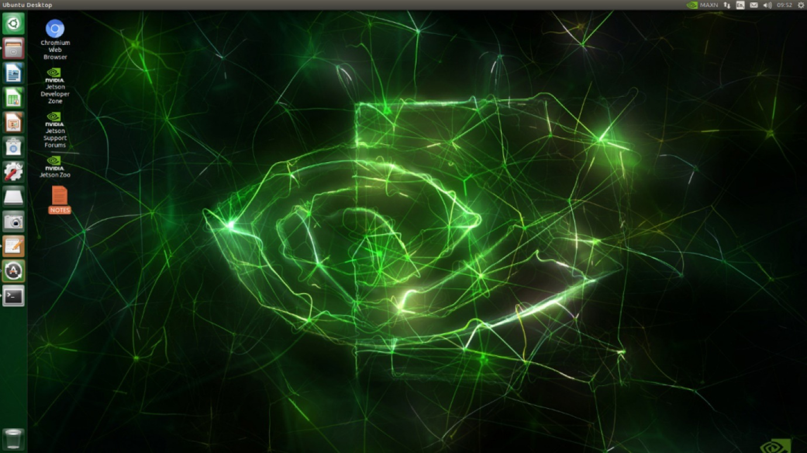
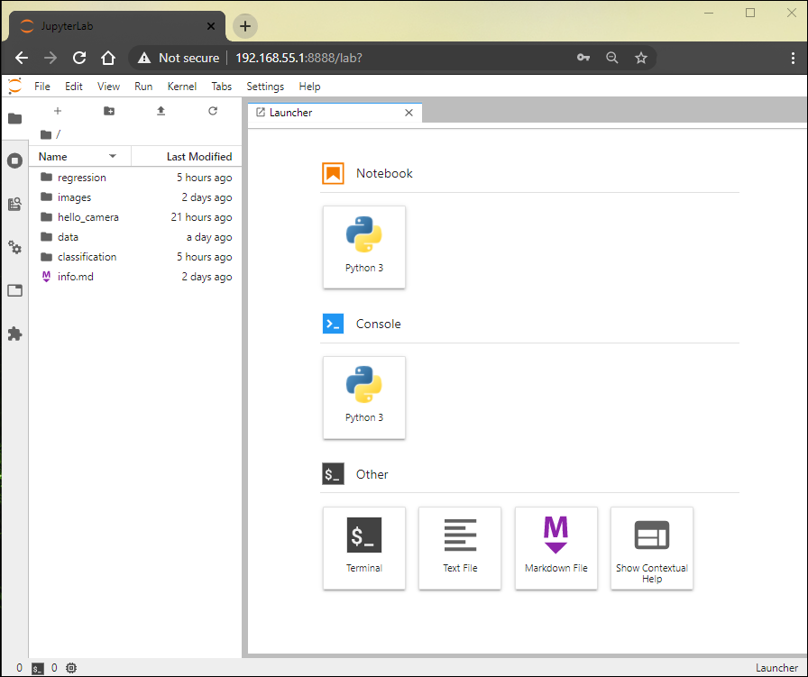

# Let's Start

## 1. Gathering of Hardware Requirements

- [NVIDIA Jetson Nano Developer Kit (4GB)](https://openzeka.com/urun/nvidia-jetson-nano-developer-kit/)
- [5V/4A Adaptor](https://openzeka.com/urun/nvidia-jetson-nano-developer-kit/) 
- [64GB microSD card](https://openzeka.com/urun/nvidia-jetson-nano-developer-kit/) 
- [Raspberry Pi V2 Kamera](https://openzeka.com/urun/nvidia-jetson-nano-developer-kit/)
- [Acrilic Case (optional) ](https://openzeka.com/urun/nvidia-jetson-nano-developer-kit/)

## 2. First Time Setup The NVIDIA Jetson Nano Developer Kit (4GB):
- Connect the MicroSD card to your Laptop / PC
- Download [SD Card Formatter](https://www.sdcard.org/downloads/formatter/sd-memory-card-formatter-for-windows-download/) and quick format the MicroSD card.
- [SD card Image](https://developer.nvidia.com/embedded/l4t/r32_release_v7.1/jp_4.6.1_b110_sd_card/jeston_nano/jetson-nano-jp461-sd-card-image.zip) (JetPack 4.6.1)
- Download [balenaEtcher Portable](https://etcher.balena.io/#download-etcher) and flash the microSD card with downloaded SD Card Image.
  
 
- Insert the SD card in kit
- Turn on power supply & wait for system to boot
- You have to set initial configuration
  - Accept the NVIDIA Jetson software EULA
  - Select system configuration (language, keyboard layout and time zone)
  - Create username, password and computer name
  - Configure the networking (optional)
  - Select the APP partition size (it is recommended to use the maximum size)
- Welcome screen
  
 
 
- You can review all process [Jetson AI Fundamentals - S1E1 - First Time Setup with JetPack](https://www.youtube.com/watch?v=uvU8AXY1170)   

## 3. First Time Application Requirements and Environment Setup
- Open terminal and run this script to use device ram at full capacity and efficiently
  >sudo systemctl disable nvzramconfig 
  >sudo fallocate -l 4G /mnt/4GB.swap 
  >sudo chmod 600 /mnt/4GB.swap 
  >sudo mkswap /mnt/4GB.swap 
  >sudo su 
  >echo "/mnt/4GB.swap swap swap defaults 0 0" >> /etc/fstab 
  >exit 
  >sudo shutdown -r now 

- After restarting, open terminal and clone the files from github
  > git clone --recursive https://github.com/kenankocadurdu/IoMT-Bact

- Download and run the docker image
  >echo "sudo docker run --runtime nvidia -it --rm --network host --volume ~/IoMT-Bact:/nvdli-nano/IoMT-Bact --volume /tmp/argus_socket:/tmp/argus_socket --device /dev/video0  nvcr.io/nvidia/dli/dli-nano-ai:v2.0.2-r32.7.1" > docker_run.sh 
  >chmod +x docker_run.sh 
  >./docker_run.sh 

- Wait until downloading and running docker
- Finally join the jupyter lab on the device, open browser "your_device_ip:8888" (192.168.55.1:8888), password: dlinano
  
  

## [1. Data Collection](1.data_collection.ipynb)
## [2. Training](2.training.ipynb)
## [3. Prediction](3.prediction.ipynb)