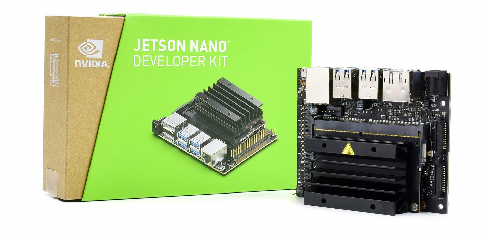

# IoMT-Bact : Internet of Medical Things (IoMT) for Enhanced Detection of Gram-Stained Bacterial Strains with Jetson Nano

```
This project is a submission for the NVIDIA Jetson AI Specialist Certification.
```

 [](LICENSE)

## 1. Introduction

**The Internet of Medical Things (IoMT)** represents a paradigm shift in the healthcare industry, leveraging the interconnectedness of medical devices, sensors, and data analytics to revolutionize patient care and diagnostics. IoMT holds the potential to bring about transformative changes in various aspects of healthcare, ranging from remote patient monitoring to advanced diagnostic techniques.

One compelling application of IoMT lies in the realm of microbiology and disease diagnosis, particularly in the field of bacteriology. Gram staining, a fundamental technique in microbiology, is used to differentiate bacterial strains into two main groups: Gram-positive and Gram-negative. This technique provides valuable insights into bacterial cell wall composition, aiding in the identification and classification of bacterial species. Accurate classification of bacterial strains is pivotal in determining appropriate treatment strategies and disease management.

However, traditional methods of gram-stained bacterial strain detection often rely on manual interpretation by trained microbiologists, which can be time-consuming and prone to subjectivity. Here is where the convergence of IoMT and advanced computing technologies, such as the NVIDIA Jetson Nano platform, offers a promising solution.

The NVIDIA Jetson Nano platform is a compact and powerful system designed for AI-powered edge computing applications. Equipped with a high-performance GPU, the Jetson Nano enables real-time data processing, complex pattern recognition, and AI-driven decision-making. Leveraging this computational prowess, the IoMT-Bact project aims to enhance the accuracy and efficiency of gram-stained bacterial strain detection.

## 2. NVIDIA Jetson Nano

The NVIDIA Jetson Nano is a small-sized, powerful single-board computer (SBC) developed by NVIDIA, a company well-known for its graphics processing units (GPUs) and AI-focused technologies. The Jetson Nano is specifically designed for tasks related to artificial intelligence (AI), machine learning, and robotics. It's part of NVIDIA's Jetson family of products, which are targeted at enabling AI and deep learning applications at the edge.




## 3. Let's Start
This guide showcases the necessary hardware prerequisites, the initial installation process for Jetson Nano, and the configuration steps required to set up the application environment using Docker and Jupyter Lab.

- [Let's Start.md](LetsStart.md)

## 4. Data Collection
This step, the process of gathering microscope images, categorizing them for classification, and incorporating them into datasets. These datasets are used for training or further analysis using the Jetson Nano and a camera.

- [Data Collection](1.data_collection.ipynb)

## 5. Training
Once you have collected the microscope images, categorized them, and incorporated them into datasets, the next step is to train a machine learning model on these datasets. The goal of this training process is to enable the model to recognize patterns in the images and learn to classify new, unseen images into the appropriate categories. 

- [Training](2.training.ipynb)

## 6. Prediction
After training a machine learning model on your categorized microscope image datasets, the next step is to evaluate how well the trained model performs in classifying new images that it hasn't seen during training. The purpose of this step is to ensure that the model can generalize its learned patterns to different data and assess its accuracy and effectiveness. 

- [Prediction](3.prediction.ipynb)

## 7. Contributor

[Reyhan YİŞ - Associate Professor, Izmir Bakırçay University, Faculty of Medicine, Department of Medical Microbiology, Izmir, Turkey](https://tr.linkedin.com/in/reyhan-yiş-14657b38 "Reyhan YİŞ Associate Professor, Izmir Bakırçay University, Faculty of Medicine, Department of Medical Microbiology, Izmir, Turkey") 

## 8. DISCLAIMER
This project is intended for research purposes only. The primary aim of this project is to showcase the potential of Artificial Intelligence in supporting medical systems, particularly diagnostic systems.

While the model demonstrates accuracy and promising results in both theoretical and practical testing, it's important to note that it has been trained on a limited dataset. To accurately assess its precision and reliability, further training on larger and more diverse datasets is essential.

Any information or output generated by this project should not be considered a substitute for professional medical advice, diagnosis, or treatment. It is imperative that medical decisions and interpretations be made in consultation with qualified healthcare providers and experts in the relevant medical fields.

Users are encouraged to exercise caution and critical judgment when utilizing the results of this project for any medical applications. The developers and contributors disclaim any liability for inaccuracies, errors, or misinterpretations that may arise from the use of this project's outcomes in medical contexts.

By accessing and using this project, you acknowledge that you have read, understood, and agreed to this disclaimer.


